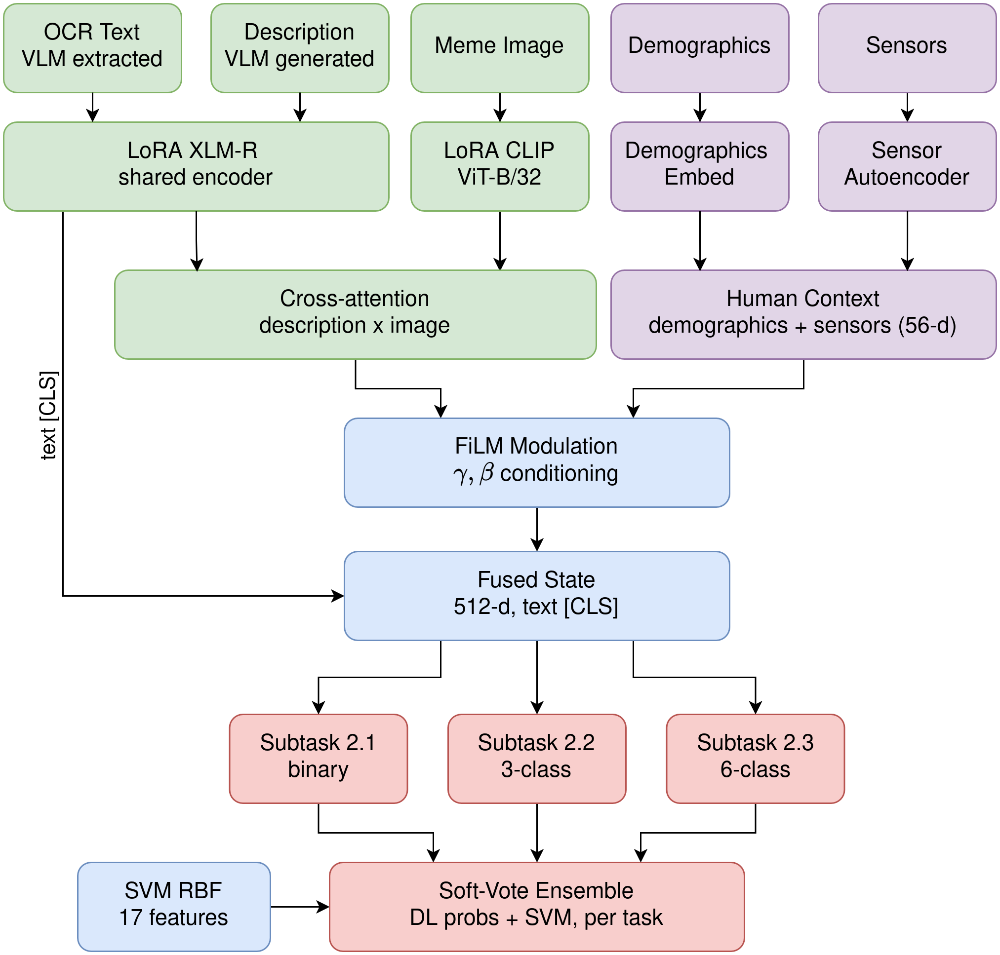

<div align="center">

# Through the Eyes of the Beholder: Biometric and Demographic Conditioning for Multimodal Sexism Detection
### EXIST Lab at CLEF 2026, Task 2 - Team VANGUARD


[Ana-Maria Luisa Mocanu](https://scholar.google.com/citations?user=Kw4_jBMAAAAJ&hl=en), [Sebastian Mocanu](https://scholar.google.com/citations?user=osyBED4AAAAJ&hl=en),
[Ciprian-Octavian Truică](https://scholar.google.com/citations?user=ZOKqr-QAAAAJ&hl=en), [Elena-Simona Apostol](https://scholar.google.com/citations?user=XUZcjpEAAAAJ&hl=en)

[](https://When-Paper-Appears-it-Will-Work.com)
[](https://github.com/DS4AI-UPB/VANGUARD-CLEF2026-EXIST)
[](https://arxiv.org/abs/WIP)
[](#citation)


[](LICENSE)
[](https://www.python.org/downloads/)

**Ranked 29th of 114** on EXIST 2026 Subtask 2.2 (source intention) under soft evaluation, and **above the organizer baselines** on Subtasks 2.1 and 2.2.
</div>

## Overview

This system addresses EXIST 2026 Task 2 with a **human-centered multimodal framework**: instead of predicting a single ground-truth label, it learns from annotator disagreement and conditions its predictions on *who saw the meme and how they physically reacted to it*. The central question is whether the psychological and demographic context of perception carries usable signal for a subjective task like sexism detection.

The model fuses **five input streams** (i.e., VLM-extracted embedded text, a VLM-generated visual description, the meme image, annotator demographics, and a physiological sensor vector) through a cross-attention architecture with Feature-wise Linear Modulation (FiLM) conditioning.

The pipeline has five stages:
1. **VLM enrichment:** Gemma 4 (via Ollama) extracts clean, uncensored embedded text and a structured visual description from each meme, with a fallback re-extraction pass for items whose JSON output fails to parse.
2. **Cross-lingual augmentation:** NLLB-200 translates cleaned text and descriptions between English and Spanish, roughly doubling the training set and encouraging language-invariant representations.
3. **Sensor warm start:** a sensor autoencoder is pretrained ($4 \rightarrow 64 \rightarrow 32$) to reconstruct the 4-D physiological vector; its encoder is injected into the main model.
4. **Multimodal fusion:** LoRA-adapted XLM-RoBERTa (shared for text + description) and LoRA-adapted CLIP ViT-B/32 (image) feed a multi-head cross-attention layer that grounds the description in the image. The fused state is then modulated by FiLM using the 56-D human-context vector and shared across three task heads.
5. **Neural-classical ensemble:** at inference the deep model is soft-voted with a feature-based SVM (RBF kernel, 17 handcrafted stylometric + demographic + physiological features), with blend weight and threshold grid-searched on validation.

Training treats Subtask 2.1 as **label distribution learning**, optimizing a soft-label KL divergence over the full annotator distribution, with supervised contrastive learning as an auxiliary objective.

<div align="center">
  
  <br>
  <em>Figure 1: Overview of the five-stream FiLM-conditioned cross-attention architecture.</em>
</div>

---

## Results

Official EXIST 2026 results for the best submitted run per language split. The system is most competitive on Subtask 2.2 (source intention) and clears the organizer majority-class baseline by a wide margin on Subtasks 2.1 and 2.2.

| Subtask                  | Split | Rank (soft) | ICM-Soft Norm | Rank (hard) | ICM-Hard Norm | F1 (hard) |
|--------------------------|-------|-------------|---------------|-------------|---------------|-----------|
| **2.1** Binary sexism    | All   | 75/141      | 0.4109        | 117/214     | 0.4861        | 0.6920    |
|                          | EN    | 75/141      | 0.4292        | 86/214      | 0.5496        | 0.7336    |
|                          | ES    | 70/141      | 0.3909        | 141/214     | 0.4306        | 0.6697    |
| **2.2** Source intention | All   | **29/114**  | 0.3389        | 71/183      | 0.3612        | 0.3719    |
|                          | EN    | 30/114      | 0.3572        | 60/183      | 0.3854        | 0.3825    |
|                          | ES    | 31/114      | 0.3169        | 69/183      | 0.3479        | 0.3644    |
| **2.3** Fine-grained     | All   | 41/115      | 0.1568        | 138/184     | 0.0703        | 0.0919    |
|                          | EN    | 41/114      | 0.1607        | 143/183     | 0.0747        | 0.0938    |
|                          | ES    | 38/114      | 0.3169        | 130/183     | 0.0667        | 0.0901    |

For reference, the organizer **majority-class** baseline on the All split scores 0.2947 (2.1) and 0.1369 (2.2) hard ICM-Norm, both cleared by a wide margin. Subtask 2.3 is the hard case: the soft score (0.1568) beats the majority baseline (0), but the hard score collapses onto it.

### Our findings

1. **The pure deep model is the strongest single configuration.** Trained on the non-augmented corpus with no SVM ensemble, it achieves the best validation (0.5210 ICM-Norm) and the best All-split test score (0.4861), beating every variant that adds augmentation or the ensemble.
2. **Cross-lingual augmentation is a transfer mechanism, not a free win.** It lifts the weaker language Spanish at the cost of the stronger one English (e.g. on validation $0.4249 \rightarrow 0.4925$ ES while $0.5494 \rightarrow 0.5001$ EN). Our best *English* test score comes from the augmented + ensemble run.
3. **The SVM ensemble is a regularizer, not a uniform improvement.** It helps in the noisier (augmented) training regime but adds variance when the deep model is already well fit. This is why no single submission dominates all splits.
4. **No individual component survives multiple-comparison control.** Across a family of 63 ablation tests over 5 seeds, no architectural component (including the FiLM annotator conditioning) produces an effect distinguishable from seed-to-seed variance after Holm-Bonferroni correction. The system signal arises from *integration* of components, and we report this negative result openly.
5. **The image stream stabilizes training.** Removing it leaves the mean roughly unchanged but inflates variance dramatically (+/-0.089 on Subtask 2.1 vs. <= 0.023 for other ablations).
6. **Subtask 2.3 is bound by multi-task interference.** The 2.3 head collapses to a near-trivial solution across nearly all multi-task configurations; only single-task training on 2.3 breaks the pattern.

---

## Naming paper terms to code

| Paper term                                                            | Code location                                                                              |
|-----------------------------------------------------------------------|--------------------------------------------------------------------------------------------|
| **VLM text + visual description extraction**                          | `preprocess/extract_ocr.py`, fallback in `preprocess/extract_ocr_missing.py`               |
| **Cross-lingual augmentation** (`_aug` suffix)                        | `dataset/augument_data.py`                                                                 |
| **Soft-label KL divergence** (label distribution learning)            | `kl_soft_loss` in `train/nn/losses.py`; targets built in `dataset/extract_labels.py`       |
| **Uncertainty-weighted KL** (single-task only, not in multitask runs) | `compute_loss` in `train/nn/losses.py`, `compute_loss_2_1` in `train/train_single_task.py` |
| **SupCon auxiliary loss** ($\tau = 0.07$)                             | `supervised_contrastive_loss` in `train/nn/losses.py`                                      |
| **Auxiliary sexism head**                                             | `aux_sexism_head` in `train/nn/meme_classifier.py`                                         |
| **Sensor autoencoder** ($4\rightarrow64\rightarrow32$)                | `SensorAutoencoder` in `train/nn/meme_classifier.py`; weights in `smart_sensor_weights.pt` |
| **FiLM human conditioning** (56-D context)                            | `film_gamma` / `film_beta` in `train/nn/meme_classifier.py`                                |
| **SVM ensemble** (17 features, soft-vote)                             | `train/ensemble_pipeline.py`                                                               |
| **Component ablations** (`no_film`, `no_image`, `text_only`, ...)     | `train/train_ablations.py` + `train/nn/meme_classifier_ablation.py`                        |
| **Holm-Bonferroni significance test** (family of 63)                  | `evaluate/aggregate_ablations.py`                                                          |

---

## Setup

Install the [UV](https://docs.astral.sh/uv/) package manager and run:
```bash
uv sync
```

Or use pip in a virtual environment:
```bash
python -m pip install -r requirements.txt
```

Install the project as package so `exist_2026` is importable (or use `uv run` and it installs itself):
```bash
python -m pip install -e .
```

VLM enrichment (Step 1) needs a local **[Ollama](https://ollama.com/)** server with the Gemma 4 model pulled:
```bash
ollama pull gemma4:e4b
```

### Hardware used

| Component                  | GPU                                            |
|----------------------------|------------------------------------------------|
| Multimodal training (LoRA) | NVIDIA GPU (RTX 3060 and RTX 4090)             |
| Multi-seed ablations       | up to 4 GPUs in parallel (one seed per device) |

---

## Data

This repository uses the official EXIST 2026 dataset (3,984 memes viewed by 16 subjects, with eye-tracking, heart-rate, and EEG signals). **The data is not provided in this repository.**

Expected directory layout (configurable via `path_manager.py`, `DATA_EXIST_DIR = data/exist-memes`):

```
data/exist-memes/
├── training/
│   ├── EXIST2026_training.json     # raw dataset
│   ├── memes/                      # meme images
├   ├── processed_data.json         # produced by preprocessing.py
│   └── ocr_results*.json           # produced by Step 1
└── test/
    ├── EXIST2026_test_clean.json
    ├── memes/
    ├── processed_data.json         # produced by preprocessing.py
    └── ocr_results*.json           # produced by Step 1
```

`runnable/preprocess.py` produces the `ocr_results.json` and `processed_data.json` files the trainer consumes. All canonical paths are centralized in [`src/exist_2026/path_manager.py`](src/exist_2026/path_manager.py).

---

## How to run

All entry points live in [`runnable/`](runnable/). thin CLI wrappers around the library functions. **Every flag has a sensible default matching the canonical data layout**, so the zero-argument form works if your data is in the standard place; override any path or hyperparameter with flags, and run `--help` on any script to see all options. If you want to navigate the code you can run the modules directly also via `parseargs`.

After `pip install -e .`, run the steps in order from the repository root:

```bash
python runnable/preprocess.py     # 1. VLM OCR + cleaning  (needs Ollama: ollama pull gemma4:e4b)
python runnable/augment.py        # 2. (optional) cross-lingual augmentation
python runnable/train.py          # 3. train the multitask model (best All-split config)
python runnable/evaluate.py       # 4. re-score the trained run on validation
```

### A. Preprocess (`runnable/preprocess.py`)

VLM extraction (clean text + visual description) followed by cleaning and the 4-D sensor-vector precompute. Resumes from a checkpoint if interrupted.

```bash
python runnable/preprocess.py
python runnable/preprocess.py --splits training            # one split only
python runnable/preprocess.py --data /path/to/exist-memes  # custom data root
```

### B. Augment (`runnable/augment.py`) - optional

Cross-lingual EN<->ES translation with NLLB-200, roughly doubling the training set. Run after preprocess. Also resumes from a checkpoint.

```bash
python runnable/augment.py
python runnable/augment.py --batch-size 32
python runnable/augment.py --input-file path/to/processed_data.json --output-file path/to/aug.json
```

### C. Train (`runnable/train.py`)

One entry point covering all three variants via `--variant`. Defaults to the multitask model (all subtasks, no ensemble) which are the paper's best All-split configuration. Checkpoints the best model to `best_model.pt` with early stopping, an LR scheduler, a per-epoch `training_log.csv`, and training-curve plots. The test set is used only if present (otherwise it trains/validates only).

```bash
python runnable/train.py                          # multitask (default)
python runnable/train.py --variant ensemble       # multitask + SVM soft-vote ensemble
python runnable/train.py --variant single --task 2.1
python runnable/train.py --num-epochs 30 --lora-r 8 --seed 42
python runnable/train.py --tasks 2.1 2.2          # subset of subtasks (multitask/ensemble)
```

Some flags: `--variant {multitask,ensemble,single}`, `--task {2.1,2.2,2.3}` (for `single`), `--tasks`, `--json-path`, `--img-dir`, `--test-json`, `--test-img-dir`, `--save-dir`, `--train-ratio`, `--text-model`, `--image-model`, `--seed`, `--num-epochs`, `--lora-r`, `--lora-alpha`. Default save dir is `output/results/task_1/<variant>`.

### D. Evaluate (`runnable/evaluate.py`)

Re-score a trained run on the held-out validation split. **`--seed`, `--lora-r`, `--lora-alpha`, and `--train-ratio` must match the training run**, or the val split will differ.

```bash
python runnable/evaluate.py --run-dir output/results/task_1/multitask
python runnable/evaluate.py --run-dir output/results/task_1/multitask --all-langs   # per-language All/EN/ES
```

### Ablations (module CLIs)

The multi-seed component ablations use the modules own CLIs directly. Run all 10 configs per seed, repeating across seeds (the paper uses 5); finished runs are skipped automatically.

```bash
# all 10 configs, one seed
python -m exist_2026.train.train_ablations --seed 42

# parallelize across GPUs/terminals with one seed per device
CUDA_VISIBLE_DEVICES=1 python -m exist_2026.train.train_ablations --seed 43
CUDA_VISIBLE_DEVICES=2 python -m exist_2026.train.train_ablations --seed 44

# or split configs across devices for one seed
CUDA_VISIBLE_DEVICES=1 python -m exist_2026.train.train_ablations --names baseline,no_film,no_description,text_only
CUDA_VISIBLE_DEVICES=2 python -m exist_2026.train.train_ablations --names no_image,no_contrastive,only_2_1

# once all seeds are done: Welch t + Mann-Whitney U + Holm-Bonferroni vs baseline
python -m exist_2026.evaluate.aggregate_ablations
python -m exist_2026.evaluate.aggregate_ablations --alpha 0.05 --ablation-root output/results/task_1/ablations
```

### Dataset EDA plots

```bash
python -m exist_2026.analysis.data_analysis --plots-dir output/analysis/plots
python -m exist_2026.analysis.sensor_data_analysis --input-file data/exist-memes/training/processed_data.json --output-dir output/analysis/plots
```

---

## Configuration quick reference

Most components are function defaults in the training scripts; task definitions and thresholds live in `consts/`.

**Task definitions: `consts/task_config.py`**
- `Task21` / `Task22` / `Task23`: label sets and class counts (2 / 3 / 6 classes).
- `Config.HARD_THRESHOLD_2_1/2_2/2_3`: annotator-count thresholds for hard labels.
- `Config.SKIP_LABELS`: labels discarded during target construction (`-`, `UNKNOWN`, `""`).

**Sensor fallbacks: `consts/sensor_values.py`**
- `DefaultSensorValues`: values used when a meme has missing reaction-time / fixation / saccade / HR-std data.

**Model & training defaults** (in `train/train_multitask.py`, `helpers.build_optimizer`)

| Component                           | Value                                             | Flag                                       |
|-------------------------------------|---------------------------------------------------|--------------------------------------------|
| Text encoder                        | `FacebookAI/xlm-roberta-base` (LoRA)              | `--text-model`                             |
| Image encoder                       | `openai/clip-vit-base-patch32` (LoRA)             | `--image-model`                            |
| LoRA rank / α                       | 16 / 32                                           | `--lora-r` / `--lora-alpha`                |
| LoRA dropout                        | 0.1                                               | -                                          |
| Projection / fused dims             | 256-D fused, 512-D final state, 128-D contrastive | -                                          |
| Human-context vector                | 56-D (demographics + 32-D sensor embedding)       | -                                          |
| Differential LR (heads / LoRA)      | 3e-5 / 8e-6, weight decay 0.1                     | -                                          |
| Batch / grad-accum / clip           | 16 / 4 / 1.0                                      | -                                          |
| Loss weights (aux / contrastive)    | 0.3 / 0.1                                         | available on direct run (not runnable dir) |
| SupCon temperature                  | 0.07                                              | -                                          |
| Train ratio                         | 0.8                                               | `--train-ratio`                            |
| Epochs / seed                       | 50 / 42                                           | `--num-epochs` / `--seed`                  |
| Early stopping / scheduler patience | 5 / 1                                             | -                                          |

**Ensemble - `train/ensemble_pipeline.py`**
- SVM: RBF kernel, `C=1.0`, balanced class weights; One-vs-Rest for Subtask 2.3.
- 17-D feature vector: 4 stylometry + 2 demographic ratios + 4 eye-tracking + 2 heart-rate + 5 EEG bandpower.
- Blend weight and threshold grid-searched on validation to maximize macro F1.

---

## Repository layout

```
runnable/              # CLI entry points: preprocess, augment, train, evaluate
src/exist_2026/
├── analysis/          # dataset & sensor EDA, OCR coverage checks
├── consts/            # task label sets, thresholds, sensor fallbacks
├── dataset/           # data loader, label/target extraction, NLLB augmentation
├── evaluate/          # PyEvALL scoring, multitask eval, re-scoring trained runs, ablation aggregation
├── preprocess/        # Gemma-4 OCR + description extraction, cleaning, merging
├── train/
│   ├── nn/            # model, ablation model, losses, early stop, determinism
│   ├── train_multitask.py
│   ├── train_multitask_ensemble.py
│   ├── train_single_task.py
│   ├── train_ablations.py
│   ├── train_t1.py
│   └── ensemble_pipeline.py
├── visualization/     # training curves, data plots, random-sample previews
└── path_manager.py    # centralized paths
```

---

## Citation

**WIP: Placeholder until the official proceedings entry is available:**
```bibtex
@InProceedings{Mocanu_2026_EXIST_CLEF,
    author    = {Mocanu, Ana-Maria Luisa and Mocanu, Sebastian and Truică, Ciprian-Octavian and Apostol, Elena-Simona},
    title     = {Through the Eyes of the Beholder: Biometric and Demographic Conditioning for Multimodal Sexism Detection},
    booktitle = {Conference and Labs of the Evaluation Forum (CLEF), EXIST 2026 Lab, Task 2},
    month     = {September},
    year      = {2026}
}
```

## License

Released under the [MIT License](LICENSE).